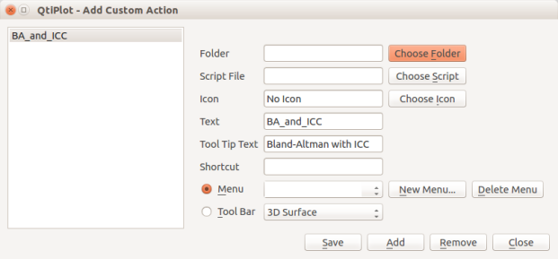
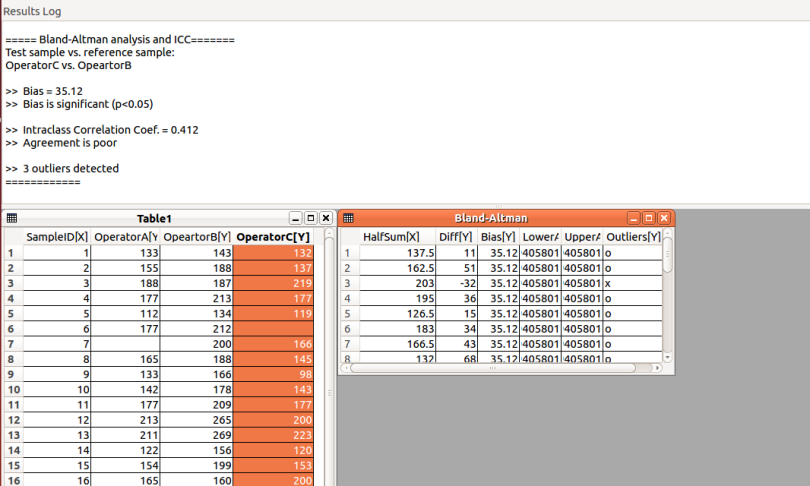
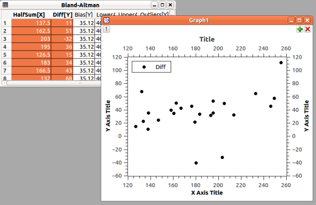
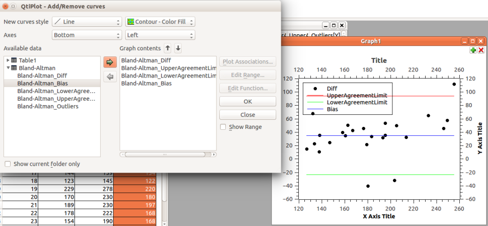
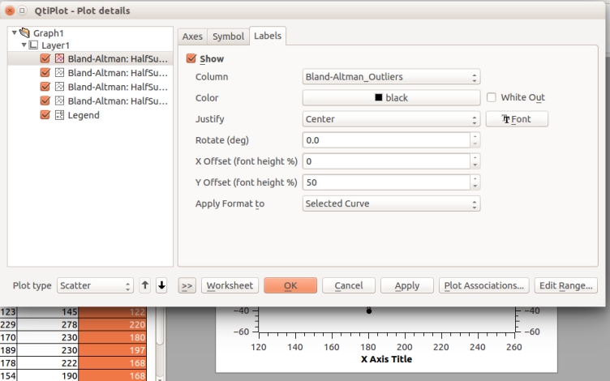
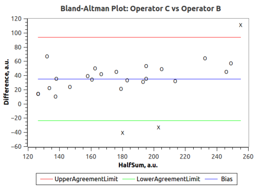

# Bland-Altman Plot with Intraclass Correlation Coefficient Calculation: A python script to use within QtiPlot

Author:	Vitaly Efremov <v_a_efremov at yahoo.com> 

First time released: 12-12-2017

License: [GPL-2](http://cran.nexr.com/web/licenses/GPL-2)

## Theory
- A Bland–Altman plot (difference plot) is a qualitative method of analysis of agreement. In analytical chemistry or biomedicine it is used when analyzing the agreement between two different assays targeting the same analyte. Bland and Altman make the point that any two methods that are designed to measure the same parameter (or property) should have good correlation when a set of samples are chosen such that the property to be determined varies considerably. A high correlation does not necessarily imply that there is good agreement between the two methods, and, therefore, it should be replaced by a manual analysis of the paired data representation of some sort. [More...](https://pubmed.ncbi.nlm.nih.gov/10501650/)
- The intraclass correlation coefficient (ICC) is a descriptive statistic that can be used when quantitative measurements are made on units that are organized into groups. It describes how strongly units in the same group resemble each other. The intraclass correlation is commonly used to asses the consistency or reproducibility of quantitative measurements made by different observers measuring the same quantity. The ICC is often used in analytical chemistry or biomedicine to quantify the agreement between various assays that target the same analyte or the agreement between measurements done by two operators on the same assay. [More...](https://www.ncbi.nlm.nih.gov/pmc/articles/PMC4913118/)
- Here, the Bland–Altman plot is integrated with ICC calculation that enables the overwhelming assessment of the agreement, both in qualitative and quantitative manner  

## How to start
The script is tested and works fine with QtiPlot versions up to 0.9.8.9 and python 2.7. The compatibility with later versions is arguable. The script uses numpy and it is likely that QtiPlot won't support its correct import. In order to enable numpy import use a code that can be simply typed in the beginning of the script similarly to this:

```python
import sys
sys.path.append("/home/.../lib/python2.7/site-packages/") 
``` 

*Note:* It is recommended to open the enclosed *testdata.qti* data for training. The sample data represents the set of measurements performed by three operators on the same object. 
 
The best practice of using data processing scripts in QtiPlot is the following sequence of steps:
- Choose python for scripting: *Scripting > Scripting language*
- Add the script to the existing menu or create a new menu: *Scripting  > Add custom script* 
<br><br>

<br><br>
- The script action should now be available for call as it has appeared in the chosen menu 
- Select two columns/variables you want to perform the analysis of and run the script
- For example, that can be OperatorC vs OperatorB as in case of working on training dataset:
<br><br>

<br><br>
- Other columns/variables can be specified by text replacement in the dialog box in the form of *col1-name$$vs$$col2-name*

## Script in action
There are two objects the script returns: set of statements in the Results log and the "Bland-Altman" table that contains processed data ready for plotting:
<br><br>

<br><br>

### Results log
There are 5 strings with results here:
- Bias between two analysed variables calculated as the mean difference between paired variables. In terms of the training dataset values, the bias represents a systematic error concerned with first operator performance with respect to the second one
- Significance of the bias determined by the paired two-tailed t-test
- Intraclass correlation coefficient value defined in its most canonical [Fisher's form](https://archive.org/details/statisticalmethoe7fish) 
- Categorical interpretation of the intraclass correlation coefficient value suggested by [Koo and Li](https://pubmed.ncbi.nlm.nih.gov/27330520/), namely dentified as *poor-moderate-good-excellent*  by the ICC thresholds of *0-0.5-0.75-0.9* 
- Total number of outliers, i.e. data pairs which stand at more than 2 standard deviation distance from each other

### Bland-Altman table
The table contains 6 columns, namely: two (HalfSum and Difference) to be scatterplotted as it is required by the Bland-Altman method, two columns for Lower and Upper Agreemnent Limit lines plotting, a column with the constant bias value and, finally, a column with outlier labels. Lower and Upper Agreemnent Limits are defined here as *Bias -/+ two standard deviations*  

## Plotting and Post-processing
One can get the publication-quality Bland-Altman plot as demonstrated here:
- Scatterplot Diff vs HalfSum:
<br><br>

<br><br>
- Right click the plot and choose *Add/Remove curves* to add the Bias along with Lower and Upper Agreemnent Limit lines picking *line* in the *New curves style* drop-down list:
<br><br>

<br><br>
- Right click the plot to choose *Properties*  to add data point labels from the corresponding column, which labels can be centered and replace the scatter point symbols (pick *No symbols*):
<br><br>

<br><br>
- Some plot attributes (Title, Axes, Legend, etc) can be edited, customized and polished in order to get the publication-quality Bland-Altman plot: 
<br><br>

